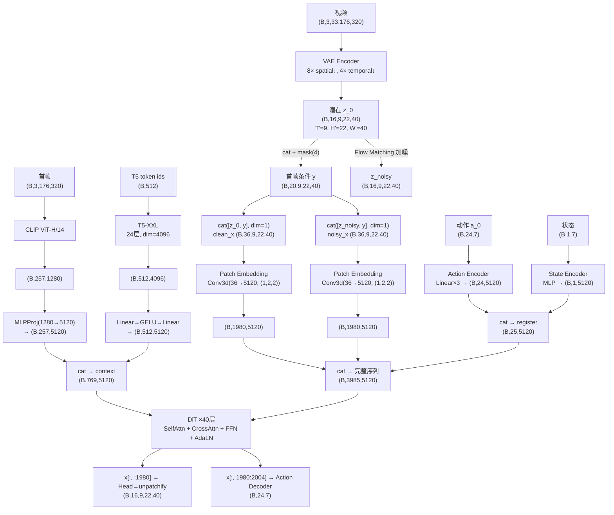

# DreamZero NPU 训练技术报告

> 服务器：华为昇腾 910 × 8 NPU | CANN 9.0.0 | torch_npu 2.7.1 | PyTorch 2.7.1  
> 容器：`dreamzero_train` — transformers 4.57.1, accelerate 1.14.0  
> 训练方式：LoRA + FSDP (`full_shard auto_wrap`)，DiT 基座冻结  
> 模型：Wan2.1-I2V-14B (~16.5B 参数, 40 层 CausalWanAttentionBlock)  
> 报告日期：2026-07-02

---

## 一、模型架构与数据流动

### 1.1 整体数据流（含 Shape）



### 1.2 DiT Block 内部结构

**因果掩码矩阵：**

| Q ↓ / K → | 干净图 | 加噪图 | 动作寄存器 | 状态寄存器 |
|------------|--------|--------|-----------|-----------|
| 干净图 | ✓ | ✗ | ✗ | ✗ |
| 加噪图 | ✓ (条件) | ✓ (因果) | ✓ (协同) | ✓ |
| 动作 | ✓ (条件) | ✓ (因果) | ✓ (因果) | ✓ |
| 状态 | ✗ | ✗ | ✗ | ✓ (仅自己) |

**SelfAttention**：Q/K/V → RoPE（3D 视频 RoPE 或 1D 动作/状态 RoPE）→ Causal FlashAttention → Projection  
**CrossAttention**：Q 来自视频 token，K/V 分别来自 CLIP (257 tokens) 和 T5 (512 tokens)  
**FFN + AdaLN**：时间步调制 (shift/scale/gate) → FFN(5120→13824→5120)

### 1.3 Flow Matching Loss

```
训练:
  σ ~ U(0, 1)                         # 连续噪声级别
  z_noisy = (1-σ)·z_0 + σ·ε           # 线性插值
  target = ε - z_0                     # 速度场目标
  Loss = MSE(v_θ(z_noisy, σ), target)  # 预测速度

L_total = weighted_MSE(v_pred, target_v) + weighted_MSE(a_pred, target_a) × action_mask
```

---

## 二、FSDP + LoRA 架构设计

### 2.1 为什么选 FSDP 而非 DeepSpeed

Wan2.1-I2V-14B 约 16.5B 参数（bf16 下约 28 GiB）。每张昇腾 910 NPU 有 61.28 GiB HBM。

- PyTorch 原生集成 — 无第三方依赖与 `torch_npu` 冲突
- HuggingFace Trainer 内置 FSDP 支持（`training_args.fsdp`）
- `torch_npu` 通过 `hccl` 后端提供 FSDP 支持

使用 `full_shard` + `auto_wrap`，每个 `CausalWanAttentionBlock` 独立包装为 FSDP 单元，每张 NPU 上模型参数从 ~28 GiB 降至 ~3.5 GiB。结合 LoRA（仅 ~108.6M 可训练参数），优化器状态开销极小。

### 2.2 模型模块树

```
WANPolicyHead（动作头，~16.5B 参数）
├── model: PeftModel → LoraModel → CausalWanModel
│   ├── blocks: ModuleList[40 × CausalWanAttentionBlock]  ← FSDP 每个独立包裹
│   │   ├── CausalWanSelfAttention（LoRA 注入 q, k, v, o）
│   │   ├── WanI2VCrossAttention
│   │   └── ffn（LoRA 注入 ffn.0, ffn.2）
│   ├── state_encoder: CategorySpecificMLP（可训练）
│   ├── action_encoder: MultiEmbodimentActionEncoder（可训练）
│   └── action_decoder: CategorySpecificMLP（可训练）
├── text_encoder: WanTextEncoder（冻结，从 nn.Module 树注销）
├── image_encoder: WanImageEncoder（冻结，注销）
└── vae: WanVideoVAE（冻结，注销）
```

### 2.3 FSDP 配置

| 参数 | 值 | 说明 |
|------|-----|------|
| 分片策略 | `full_shard auto_wrap` | 必要 |
| 自动包装单位 | `CausalWanAttentionBlock`（共 41 个 FSDP 模块） | 必要 |
| backward_prefetch | `no_prefetch` | **非默认**（默认 `BACKWARD_PRE`）。保守设置，避免 NPU pre-backward hook 的状态检查问题（NPU 团队对 pre-backward hook 打过补丁） |
| forward_prefetch | false | 默认值 |
| limit_all_gathers | true | 默认值（PyTorch 2.x） |
| 通信后端 | HCCL | 必要 |

### 2.4 训练超参数

| 参数 | 值 |
|------|-----|
| 学习率 | 1e-4 |
| 预热比例 | 0.05 |
| 权重衰减 | 1e-5 |
| 每卡 batch size | 1 |
| 精度 | bf16 |
| 梯度检查点 | `use_reentrant=True` |
| 视频帧数 / 动作 horizon / 视角数 | 33 / 24 / 3 |
| LoRA rank / alpha | 4 / 4 |
| LoRA 目标模块 | q, k, v, o, ffn.0, ffn.2 |
| 可训练参数 | ~108.6M（基座 16.5B 的 0.65%） |

---

## 三、FSDP 关键代码适配

FSDP 本身提供了完整的分片训练机制（参数分片、all-gather、reduce-scatter、优化器状态分片），但 DreamZero 的模型结构需要 3 处手动适配。

### 3.1 执行流程

```
from_pretrained() → 加载 14B 权重到 CPU
    ↓
set_trainable_parameters()
    ├── add_lora_to_model()                → 注入 LoRA（PEFT 创建 fp32 参数）
    ├── self.to(dtype=torch.bfloat16)      → 【适配 3】统一 bf16
    └── _deregister_frozen_encoders()      → 【适配 2】隐藏 T5/CLIP/VAE
    ↓
Trainer.__init__()
    └── _move_model_to_device() → return   → 【适配 1】跳过整体搬移
    ↓
accelerator.prepare(model)
    └── FSDP wrapping（框架自带）
         ├── auto_wrap：每个 CausalWanAttentionBlock → FSDP 单元
         └── 分片 → 每张 NPU 只保留 1/8 参数
```

### 3.2 适配 1：跳过 Trainer 整体设备搬移

**文件**：`groot/vla/experiment/base.py`

HuggingFace Trainer 在 FSDP wrapping 之前会调用 `_move_model_to_device(model, device)` 把整个模型（~28 GiB）搬到一张卡上，直接打爆单卡显存。

```python
def _move_model_to_device(self, model, device):
    if self.args.fsdp:
        return  # FSDP 自行处理设备放置，不需要先整体搬移
    super()._move_model_to_device(model, device)
```

### 3.3 适配 2：冻结编码器从 Module 树注销

**文件**：`groot/vla/model/dreamzero/action_head/wan_flow_matching_action_tf.py`

T5 文本编码器（~4.5B）、CLIP 图像编码器、VAE 不参与训练，但仍是 `nn.Module` 子模块。FSDP 会尝试对所有子模块做分片和搬移。

```python
def _deregister_frozen_encoders(self):
    # 从 Module 树移除，保留为普通 Python 属性
    for name in ['text_encoder', 'image_encoder', 'vae']:
        module = getattr(self, name)
        del self._modules[name]
        object.__setattr__(self, name, module)
```

注销后编码器对 `nn.Module.parameters()`、`named_modules()` 和 FSDP 不可见，但仍可在 forward 中正常使用。编码器留在 CPU 上，首次 forward 时延迟移至 NPU。

### 3.4 适配 3：统一 bf16 数据类型

**文件**：`groot/vla/model/dreamzero/action_head/wan_flow_matching_action_tf.py`

FSDP 的 `FlatParameter` 要求同一单元内所有参数数据类型一致。但 PEFT 默认以 fp32 创建 LoRA 参数，而骨干模型是 bf16。

```python
# 在 LoRA 注入之后、FSDP wrapping 之前
self.to(dtype=torch.bfloat16)        # 统一数据类型
self._deregister_frozen_encoders()
```

---

## 四、数据集

### 4.1 DROID 数据集

基于 [DROID 1.0.1](https://droid-dataset.github.io/)，经格式转换（RLDS → LeRobot v2.0）、空闲帧移除、语言过滤、成功过滤后保留 ~76,000 episodes。

**下载状态**（服务器 `/data/droid_mirror/`）：57,398 parquet（完整），63,279/~172K 视频（37%），共 50 GiB。训练使用 sharded 加载，已有数据足够启动训练。

### 4.2 格式与模态

```
droid_lerobot/
├── data/chunk-000/
│   └── episode_XXXXXX.parquet     # 动作(24维) + 状态 + 语言
├── videos/chunk-000/
│   ├── observation.images.exterior_image_1_left/
│   ├── observation.images.exterior_image_2_left/
│   └── observation.images.wrist_image_left/
└── meta/
    ├── info.json, stats.json
    └── relative_stats_dreamzero.json
```

| 模态 | 维度 | Delta Indices |
|------|------|---------------|
| Video (×3) | 25 帧 | [0..24] |
| State | 7 维 | [0] |
| Action | 7 维 | [0..23] |
| Language | 文本 | [0] |

### 4.3 数据增强

视频：RandomCrop(0.95) → Resize(480×256) → ColorJitter → Normalize(mean=0.5, std=0.5)  
状态/动作：q99 Normalization，相对动作（`action[t] - state[anchor]`）

---

## 五、NPU 设备抽象层

### 5.1 设计

创建 `groot/vla/common/utils/device.py`，在模块加载时自动检测可用加速器，导出统一 API：

```
Device API:
  DEVICE_STR → "npu:0" | "cuda:0" | "cpu"
  DEVICE → torch.device(DEVICE_STR)
  AUTOCAST_DEVICE → "npu" | "cuda" | "cpu"
  synchronize() / empty_cache() / mem_get_info() / memory_allocated()
  get_dist_backend() → "hccl" | "nccl" | "gloo"
  gpu_supports_flash_attention() → NPU 上始终 False → SDPA 降级
```

### 5.2 算子降级路径

| NVIDIA 算子 | 昇腾 NPU | 方式 |
|------------|---------|------|
| Flash Attention 2/3 | `F.scaled_dot_product_attention` | device.py 全局降级 |
| cuDNN Attention (TE) | 跳过 | try/except |
| SageAttention | 跳过 | try/except |
| complex/polar RoPE | real-valued RoPE | `USE_REAL_ROPE` flag |
| DeepSpeed ZeRO-2 | FSDP + HCCL | 框架替换 |

---

## 六、训练前问题：FSDP 配置错误

以下问题发生在训练启动阶段（FSDP wrapping 和数据集初始化），直接影响训练能否启动。**这些问题都已在 v40 smoke test 之前全部解决。**

### 6.1 FSDP 混合数据类型 ValueError

**报错**：
```
ValueError: Must flatten tensors with uniform dtype but got torch.bfloat16 and torch.float32
```

**根因**：FSDP 的 `FlatParameter` 要求同一单元内所有张量数据类型一致。PEFT 的 `get_peft_model()` 默认以 fp32 创建 LoRA 参数，而骨干模型是 bf16。

**解决**（适配 3）：`self.to(dtype=torch.bfloat16)` 在 LoRA 注入后统一所有参数为 bf16。

---

### 6.2 FSDP 未启用 auto_wrap → FlatParameter OOM

**报错**：
```
RuntimeError: NPU out of memory. Tried to allocate 30.74 GiB
```

**根因**：训练命令使用 `training_args.fsdp="full_shard"` 但没有 `auto_wrap`。**整个 14B 模型被视为一个 FSDP 单元**，创建 FlatParameter 时需要再分配 ~30 GiB 连续缓冲区，超过单卡 61 GiB。

**解决**：`training_args.fsdp="full_shard auto_wrap"`（空格分隔，不是逗号）。

---

### 6.3 Transformer 层类名错误

**报错**：
```
ValueError: Could not find the transformer layer class DiTBlock in the model.
```

**根因**：FSDP 的 auto_wrap_policy 使用 `get_module_class_from_name(model, class_name)` 查找要包裹的层。训练命令指定 `DiTBlock`（基类 `WanModel` 的 block 类），但实际模型是 `CausalWanModel`，其 block 类是 `CausalWanAttentionBlock`。

**解决**：`training_args.fsdp_transformer_layer_cls_to_wrap=CausalWanAttentionBlock`

---

### 6.4 TF32 不支持

**报错**：
```
ValueError: --tf32 requires Ampere or a newer GPU arch
```

**根因**：TF32 是 NVIDIA Ampere+ GPU 的专有特性。

**解决**：`tf32=false`

---

### 6.5 数据集 LFS 指针未解析

**报错**：
```
pyarrow.lib.ArrowInvalid: Parquet magic bytes not found in footer.
```

**根因**：从 HuggingFace 克隆的 DROID 数据集未解析 Git LFS 指针。全部 57,774 个 parquet 和 173,322 个视频文件都是 130 字节的 LFS 指针。

**解决**：编写 64 线程并行下载脚本 `fast_download.py`，使用中国镜像 `hf-mirror.com` 下载实际数据到 `/data/droid_mirror/`。

---

## 七、训练阶段：FSDP Backward OOM（核心问题）

> 这是最关键的训练问题：**step 0 正常完成，step 1 backward 必现 OOM**。
> 经 7 个版本迭代（v33 到 v40），最终定位根因并修复。

### 7.1 根因：NPU 平台 bug — `_post_backward_final_callback` 不执行

**这不是应用代码引入的问题，是 NPU 平台的 bug。**

#### 7.1.1 证据链

**(1)** 我们没有动过 FSDP 内部代码。`queue_callback` 是 PyTorch autograd 引擎的 C++ 层机制：

```python
# torch/distributed/fsdp/_runtime_utils.py
Variable._execution_engine.queue_callback(_post_backward_final_callback)
```

我们的所有改动在应用层（`device.py`、`base.py`、attention 模块），没有触及 hook 注册、reshard 或 callback 机制。

**(2)** NPU 团队自己已知有问题。容器内 `/usr/local/.../fsdp/_runtime_utils.py` 中有两处 NPU 官方补丁：

```python
# Line 726-728: [NPU PATCH] Relax handle training state check
# Line 1251: [NPU PATCH] skip prefetch state assertion
```

他们只放宽了断言（跳过报错），没有修复根因。

**(3)** `torch_npu` 的 C++ autograd 引擎对接没有正确实现 backward 完成信号，`queue_callback` 回调永远不触发。这是 C++ 层问题，Python 层修不了。

**(4)** 这个 bug 不是 DreamZero 特有的。任何在 NPU 上使用 FSDP `full_shard` 的多步训练都会受影响。Step 0 永远正常（首次注册不受影响），Step 1 必崩。

### 7.2 FSDP 参数管理原理

FSDP 把 14B 参数切成 8 份，每张 NPU 只持有约 1/8。每个 block 需要计算时通过 all-gather 拉取完整参数，计算完后 reshard 释放：

```
Backward block N:
  all-gather 完整参数 (0.77 GiB) → 计算梯度 → _post_backward_hook 触发
    → _post_backward_reshard() → 释放完整参数 → 保留 1/8 分片
```

reshard 靠注册在 AccumulateGrad 节点上的 `_post_backward_hook` 触发。这个 hook 在 **forward 阶段**注册到当前计算图的 AccumulateGrad 节点上。

### 7.3 `_post_backward_final_callback` 的职责

backward 全部完成后，autograd 引擎通过 `queue_callback` 触发该回调，负责：

1. **`_finalize_params()`** — 删除 `_post_backward_hook_state`
2. **`_catch_all_reshard()`** — 清理未 reshard 的参数
3. **`next_iter()`** — 推进 `_exec_order_data._iter`
4. **训练状态重置** — `FORWARD_BACKWARD` → `IDLE`，`BACKWARD_POST` → `IDLE`

### 7.4 OOM 连锁反应

```
Step 0 backward 完成
  → _post_backward_final_callback 不执行
  → _post_backward_hook_state 残留

Step 1 forward 开始
  → _register_post_backward_hook 检查 hasattr(flat_param, "_post_backward_hook_state")
  → 返回 True（上一步残留）
  → 跳过钩子注册

Step 1 backward 开始
  → 旧钩子绑定在 step 0 的计算图上（每个 step 新图）
  → 新计算图没有钩子
  → _post_backward_reshard() 永远不触发

结果：每个 block 的 all-gathered 参数 (0.77 GiB) + 梯度 (0.77 GiB) 不释放
  → 1.54 GiB/block × 40 blocks = 61.6 GiB → 超出 61.28 GiB HBM → OOM
```

泄漏的不是激活值（activation 由 gradient checkpointing 管理，工作正常），而是 **FSDP 分片参数的 all-gather 副本**。

### 7.5 排查历程

| 版本 | 尝试的策略 | Step 1 BW/block | 失败原因 |
|------|------|:-:|------|
| v33 (基线) | 无修复 | +1.54 GiB | OOM |
| v35 | 重置 `is_first_iter` | +1.54 GiB | `is_first_iter` 是只读 `@property`，赋值抛出 PropertyError，被 try/except 静默捕获 |
| v36 | `synchronize()` 确保同步 | +1.54 GiB | 不是异步执行问题 |
| v37 | `set_to_none=False` | +1.54 GiB | 不是梯度累积问题 |
| v39 | hook 清理 + `is_first_iter` 重置 | +1.54 GiB | 两者在同一 try 块，is_first_iter 赋值失败后整个块跳过 |
| **v40** | **`_iter=0` + 分离 try 块 + hook_state 手动清理** | **-0.12 GiB** | **成功** |

**关键教训**：`_ExecOrderData.is_first_iter` 是只读属性，底层由 `self._iter == 0` 实现。必须直接设置 `_iter = 0`。

### 7.6 修复方案

无法修复 `queue_callback` 本身（C++ 层），在应用层手动执行回调本该做的清理：

```python
# BaseTrainer.training_step() — super().training_step() 之前：

# 1. 清理 _post_backward_hook_state（核心修复）
for fsdp_module in FSDP.fsdp_modules(model):
    fp = fsdp_module._handle.flat_param
    if hasattr(fp, '_post_backward_hook_state'):
        fp._post_backward_hook_state[-1].remove()
        del fp._post_backward_hook_state

# 2. 重置执行顺序（_iter 不是 is_first_iter）
fsdp_module._exec_order_data._iter = 0
fsdp_module._exec_order_data.handles_post_forward_order.clear()

# super().training_step() 之后：

# 3. 重置 FSDP 训练状态到 IDLE
for fsdp_state in FSDP.fsdp_modules(model):
    fsdp_state.training_state = TrainingState.IDLE
    fsdp_state._handle._training_state = HandleTrainingState.IDLE
    fsdp_state._handle._ran_pre_backward_hook = False
```

修复文件：`groot/vla/experiment/base.py`

### 7.7 验证结果

| 指标 | 值 |
|------|-----|
| 训练步数 | 5/5 完成 |
| 训练时间 | 160.6s (~32s/step) |
| train_loss | 0.607 |
| action_loss | 0.494 |
| dynamics_loss | 0.243 |
| Step 0 BW 内存增长 | +0.04 GiB/block (正常) |
| Step 1 BW 内存增长 | -0.12 GiB/block (参数正确 reshard) |

### 7.8 实测显存占用

| 阶段 | 占用 |
|------|------|
| 模型加载 + 编码器 forward 后 | 12.22 GiB |
| Forward block loop 入口 | 14.64 GiB |
| Forward block 39 结束时 | 16.96 GiB |
| Step 0 backward 峰值 | ~19.46 GiB |
| Step 1+ 基线 | 15.70 GiB |

编码器 CPU 卸载有效：CLIP/T5 编码后立即将编码结果移至 CPU，释放 NPU HBM。

### 7.9 副产品：模型保存 OOM

训练完成后的 state_dict 收集（`_unshard_fsdp_state_params` → `clone()`）在已占用 55+ GiB 的情况下触发 SIGSEGV。当前 smoke test 用 `save_strategy=no` 规避。正式训练需保存前 `gc.collect()` + `empty_cache()`，或使用 `FullStateDictConfig(offload_to_cpu=True)`。

---

## 八、训练命令

完整脚本位于 `scripts/train/droid_training_npu.sh`，关键配置说明：

```bash
export DREAMZERO_DEVICE=npu
export HYDRA_FULL_ERROR=1
export PYTORCH_NPU_ALLOC_CONF=max_split_size_mb:512

# 可配置的环境变量（脚本中可覆盖）：
#   DROID_DATA_ROOT  — 数据集路径（默认 ./data/droid_lerobot）
#   WAN_CKPT_DIR     — Wan2.1 模型权重路径
#   TOKENIZER_DIR    — T5 tokenizer 路径
#   NUM_GPUS         — GPU 数量（默认 8）
#   MAX_STEPS        — 最大训练步数（默认 100000）
#   SAVE_STEPS       — checkpoint 保存间隔（默认 1000）
#   FSDP_CONFIG      — FSDP 配置文件路径（默认 /workspace/fsdp_config_v27.json）

torchrun --nproc_per_node $NUM_GPUS --standalone \
    groot/vla/experiment/experiment.py \
    report_to=none \
    data=dreamzero/droid_relative \
    wandb_project=dreamzero \
    train_architecture=lora \
    num_frames=33 \
    action_horizon=24 \
    num_views=3 \
    model=dreamzero/vla \
    model/dreamzero/action_head=wan_flow_matching_action_tf \
    model/dreamzero/transform=dreamzero_cotrain \
    num_frame_per_block=2 \
    num_action_per_block=24 \
    num_state_per_block=1 \
    seed=42 \
    training_args.learning_rate=1e-4 \
    training_args.warmup_ratio=0.05 \
    output_dir=$OUTPUT_DIR \
    per_device_train_batch_size=1 \
    max_steps=$MAX_STEPS \
    save_steps=1000 \
    weight_decay=1e-5 \
    save_total_limit=10 \
    upload_checkpoints=false \
    bf16=true \
    tf32=false \
    eval_bf16=true \
    dataloader_pin_memory=false \
    dataloader_num_workers=1 \
    image_resolution_width=320 \
    image_resolution_height=176 \
    save_lora_only=true \
    max_chunk_size=4 \
    frame_seqlen=880 \
    save_strategy=steps \
    "training_args.fsdp=full_shard auto_wrap" \
    training_args.fsdp_transformer_layer_cls_to_wrap=CausalWanAttentionBlock \
    training_args.fsdp_config=$FSDP_CONFIG \
    droid_data_root=$DROID_DATA_ROOT \
    dit_version=$WAN_CKPT_DIR \
    text_encoder_pretrained_path=$WAN_CKPT_DIR/models_t5_umt5-xxl-enc-bf16.pth \
    image_encoder_pretrained_path=$WAN_CKPT_DIR/models_clip_open-clip-xlm-roberta-large-vit-huge-14.pth \
    vae_pretrained_path=$WAN_CKPT_DIR/Wan2.1_VAE.pth \
    tokenizer_path=$TOKENIZER_DIR
```

> **Smoke test**（`smoke_test_v40.sh`）将 `MAX_STEPS` 设为 5、`save_strategy=no`、`save_steps=999999`，用于快速验证训练流程。
> 注意 `tf32=false`（NPU 不支持），`save_strategy=steps` 正式训练配合模型保存 OOM 修复后启用。

---

## 九、调用流程

```
torchrun（8 个进程）
  └─ experiment.py:main()
       └─ VLAExperiment.__init__(cfg)
            ├─ BaseTrainer.__init__()
            │   ├─ TrainingArguments(fsdp="full_shard auto_wrap", ...)
            │   └─ _move_model_to_device() → 跳过（FSDP 激活）
            │
            ├─ WANPolicyHead.__init__()
            │   ├─ CausalWanModel.from_pretrained()  [加载 14B 权重]
            │   ├─ set_trainable_parameters()
            │   │   ├─ add_lora_to_model() → PeftModel 包裹
            │   │   ├─ self.to(dtype=torch.bfloat16)  ← 统一数据类型
            │   │   └─ _deregister_frozen_encoders()  ← 隐藏 T5/CLIP/VAE
            │   └─ _ensure_*_on_device() [首次 forward 时延迟调用]
            │
            └─ accelerator.prepare(model)
                 └─ FSDP 包裹
                      ├─ auto_wrap：每个 CausalWanAttentionBlock → FSDP 单元
                      └─ 参数分片到 8 张 NPU
```

---

## 十、代码修改汇总

### 新建文件

| 文件 | 用途 |
|------|------|
| `groot/vla/common/utils/device.py` | 设备抽象层，自动检测 NPU/CUDA/CPU |
| `scripts/train/npu_train.sh` | 8 卡 NPU 训练启动脚本 |
| `scripts/train/fast_download.py` | 64 线程并行数据集下载工具 |

### 修改文件

| 文件 | 修改内容 |
|------|----------|
| `groot/vla/experiment/base.py` | `training_step()` FSDP backward 清理；`_move_model_to_device` FSDP 跳过 |
| `groot/vla/model/dreamzero/action_head/wan_flow_matching_action_tf.py` | bf16 统一；冻结编码器注销；延迟设备放置 |
| `groot/vla/experiment/experiment.py` | autocast/Event/synchronize → 设备抽象 |
| `groot/vla/experiment/utils.py` | synchronize → 设备抽象 |
| `groot/vla/common/utils/__init__.py` | 导出 device 模块 |
| `groot/vla/common/utils/misc/torch_utils.py` | seed 设置 → 设备抽象 |
| `groot/vla/configs/conf.yaml` | 添加 FSDP 配置键 |
| `groot/vla/data/transform/video.py` | `.cuda()` → 设备抽象 |
| `groot/vla/model/dreamzero/modules/attention.py` | FlashAttention → SDPA 降级 |
| `groot/vla/model/dreamzero/modules/wan2_1_attention.py` | FlashAttention → SDPA 降级 |
| `groot/vla/model/dreamzero/modules/wan_video_dit.py` | FlashAttention → SDPA 降级；`use_reentrant=True` |
| `groot/vla/model/dreamzero/modules/wan_video_dit_action_casual_chunk.py` | `use_reentrant=True`；block 调用 unpack `_kv_cache` |
| `groot/vla/model/dreamzero/modules/wan2_1_submodule.py` | NPU real-valued RoPE（不支持 complex/polar） |
| `groot/vla/model/dreamzero/modules/wan_video_vae.py` | `device='cuda'` → `DEVICE` |
| `groot/vla/model/dreamzero/modules/flow_unipc_multistep_scheduler.py` | `device='cuda'` → `DEVICE` |
| `groot/vla/model/dreamzero/modules/vram_management.py` | `mem_get_info` → 设备抽象 |
| `groot/vla/model/n1_5/sim_policy.py` | `empty_cache` → 设备抽象 |
| `eval_utils/serve_dreamzero_wan22.py` | 分布式初始化 → 设备抽象 |

---

## 十一、现已验证 ✅

1. **配置解析** — Hydra + TrainingArguments 在 8 个 rank 上成功创建，设备检测 `DEVICE: npu`，`dist: hccl`
2. **模型加载** — 14B 模型在 8 个 rank 上加载成功
3. **LoRA + FSDP 包装** — auto_wrap_policy 正确匹配 `CausalWanAttentionBlock`，41 个 FSDP 模块
4. **数据集初始化** — 所有 rank 上数据集加载正常
5. **前向传播** — 所有 40 个 block forward 完成，首 step 内存增长 2.32 GiB
6. **反向传播 ×2** — 第 2 步 backward 正常 reshard（-0.12 GiB/block），不复现 OOM
7. **train_loss 首次计算** — 0.607（action: 0.494, dynamics: 0.243）
8. **5 steps 完成** — 160.6s，~32s/step，内存稳态正常

---

## 十二、待解决

1. **模型保存 OOM** — checkpoint 保存时 all-gather + clone 触发 OOM → SIGSEGV。需在保存前释放内存或使用 `offload_to_cpu=True`
2. **视频下载** — 63,279/~172K 视频（37%）。当前数据可启动训练，全量数据可提高多样性
3. **梯度检查点 `use_reentrant=False`** — PyTorch 官方推荐用于 FSDP，可减少状态管理复杂度，但当前 `use_reentrant=True` 已验证可行
4. **向华为反馈** — `Variable._execution_engine.queue_callback()` 不触发的 bug 需反馈给 torch_npu 团队

---

## 十三、经验总结

1. **HF FSDP 选项是空格分隔** — `"full_shard auto_wrap"` 不是 `"full_shard,auto_wrap"`
2. **模块类名必须精确匹配** — `get_module_class_from_name()` 用实际类名 `CausalWanAttentionBlock`
3. **FSDP 要求统一数据类型** — PEFT 默认 fp32 → 需 `self.to(bf16)` 显式转换
4. **冻结大模块需从 nn.Module 树注销** — `del self._modules[key]` + `object.__setattr__`，FSDP 看不到
5. **is_first_iter 是只读属性** — 内部实现 `self._iter == 0`，必须直接设 `_iter`
6. **NPU 上 queue_callback 不触发** — C++ 层 bug，应用层 workaround 可行但需上游修复
7. **Git LFS 需显式下载** — `git clone` 只拿指针，需 `huggingface-cli download` 或下载脚本
