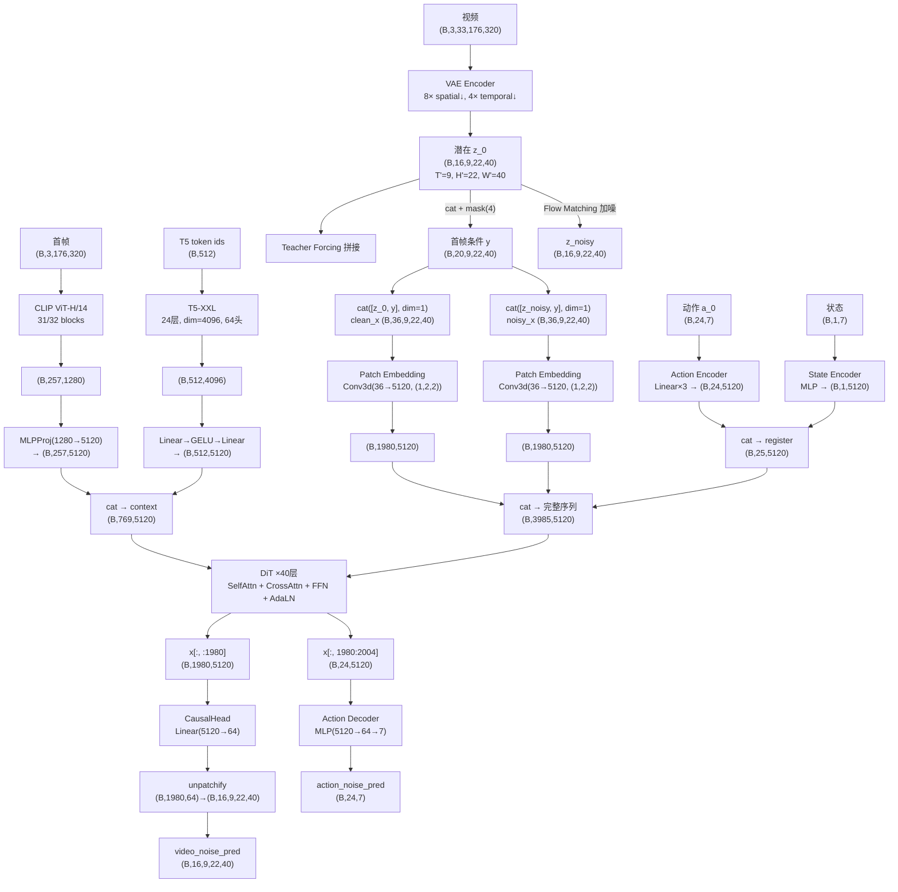
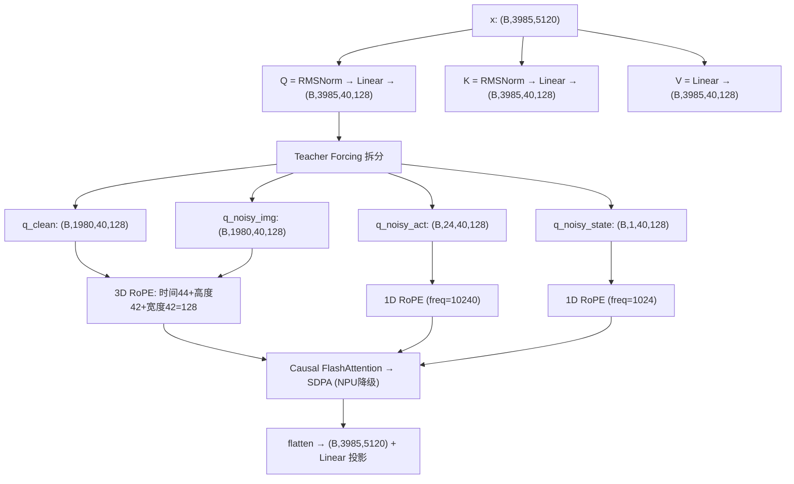
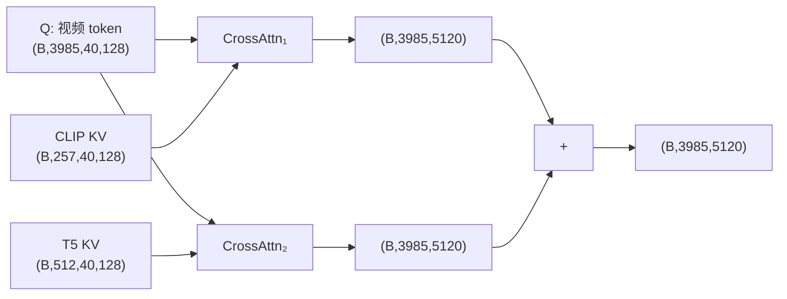
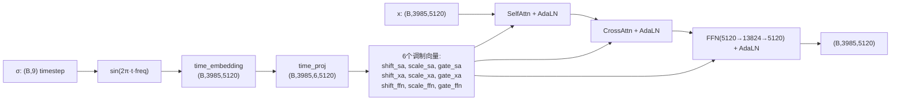
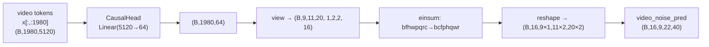
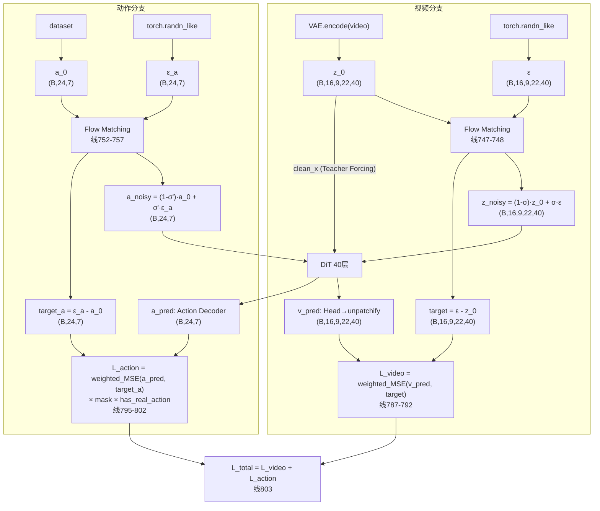

# DreamZero NPU 训练技术报告（上篇）

> 服务器：华为昇腾 910 × 16 chips | CANN 9.0.0 | torch_npu 2.7.1  
> 训练方式：LoRA + FSDP，基座冻结  
> 报告日期：2026-06-30

---

## 一、模型架构与数据流动

### 1.1 整体数据流（含 Shape）



  #### Flow Matching Loss: 变量来源与数据流

  ```mermaid
  flowchart TD
      subgraph 视频分支
          VAE["VAE.encode(video)"] --> z0_v["z_0 (latents)<br/>(B,16,9,22,40)"]
          RAND_V["torch.randn_like"] --> EPS_V["ε (noise)<br/>(B,16,9,22,40)"]
          z0_v --> FM_V["Flow Matching<br/>z_noisy = (1-σ)·z_0 + σ·ε<br/>target = ε - z_0"]
          EPS_V --> FM_V
          FM_V --> NOISY_V["noisy_latents<br/>(B,16,9,22,40)"]
          FM_V --> TGT_V["training_target<br/>(B,16,9,22,40)"]
          z0_v -->|"clean_x (Teacher Forcing 条件)"| DIT
          NOISY_V --> DIT["DiT Forward<br/>40层, 因果注意力"]
      end

      subgraph 动作分支
          DS_A["dataset actions"] --> A0["a_0 (actions)<br/>(B,24,7)"]
          RAND_A["torch.randn_like"] --> EPS_A["ε_a (noise_action)<br/>(B,24,7)"]
          A0 --> FM_A["Flow Matching<br/>a_noisy=(1-σ')·a_0+σ'·ε_a<br/>target=ε_a-a_0"]
          EPS_A --> FM_A
          FM_A --> NOISY_A["noisy_actions<br/>(B,24,7)"]
          FM_A --> TGT_A["training_target_action<br/>(B,24,7)"]
          NOISY_A --> DIT
      end

      DIT --> V_PRED["video_noise_pred<br/>(B,16,9,22,40)"]
      DIT --> A_PRED["action_noise_pred<br/>(B,24,7)"]

      V_PRED --> L_V["L_video = weighted_MSE(v_pred, target)"]
      TGT_V --> L_V
      A_PRED --> L_A["L_action = weighted_MSE(a_pred, target_a)<br/>× action_mask × has_real_action"]
      TGT_A --> L_A

      L_V --> L_TOTAL["L_total = L_video + L_action"]
      L_A --> L_TOTAL
  ```

  > **关键**: Flow Matching 预测的是"速度场" ε - z_0，不是噪声 ε 也不是原图 z_0。  
  > **训练目标**: 学习从任意加噪状态恢复到干净数据的最优方向。
```

### 1.2 DiT Block 内部 Shape 追踪

#### SelfAttention — Q/K/V + RoPE + 因果掩码



**因果掩码矩阵:**

| Q ↓ / K → | 干净图 | 加噪图 | 动作寄存器 | 状态寄存器 |
|------------|--------|--------|-----------|-----------|
| 干净图 | ✓ | ✗ | ✗ | ✗ |
| 加噪图 | ✓ (条件) | ✓ (因果) | ✓ (协同) | ✓ |
| 动作 | ✓ (条件) | ✓ (因果) | ✓ (因果) | ✓ |
| 状态 | ✗ | ✗ | ✗ | ✓ (仅自己) |

#### CrossAttention (I2V)



#### FFN + AdaLN — 时间调制



#### Head: Unpatchify 逆过程



### 1.3 推理时序列（无 Teacher Forcing）

```
无 Teacher Forcing 时仅一个序列:

  [首帧条件: 220 token] [图像块×4: 各440 token] [动作×4块: 各24] [状态×4块: 各1]

  seq_len = 220 + 4×440 = 1980
  register = 4×24 + 4×1 = 100
  total = 1980 + 100 = 2080

Blockwise Causal 注意力 (num_frame_per_block=2):
  image_blocks = 4,  action_blocks = 4,  state_blocks = 4
  每块 image:   2帧 × 220 = 440 token
  每块 action:  24 token
  每块 state:   1 token

  Tile i 的 image Q 可 attend:
    ✓ 首帧条件 (220)
    ✓ 自己块 image (440)
    ✓ 自己块 action (24) + state (1)
    不可 attend 未来块

  KV Cache:
    每层缓存: (2, B, cache_len, 40, 128)
    max_attention_size = 21 × 220 = 4620 token
    跨注意力缓存: (2, B, 512, 40, 128) [固定 T5 512 token]
```

### 1.4 配置一致性分析 ⚠️

训练配置 `frame_seqlen=880` 与 320×176 分辨率下的实际 `tokens_per_frame=220` **不一致**。

| 参数 | 配置值 | 实际值（320×176 + VAE 16ch） |
|------|--------|---------------------------|
| `frame_seqlen` | 880 | **220** |
| `action_horizon` | 24 | 需与 block 数匹配 |
| `num_frames` | 33 | 9 潜在帧（VAE 4×时间压缩） |

**原因：** 880 是 Wan2.1 在 480×256 分辨率下的 tokens_per_frame：
  - H_lat = 480/8 = 60, H_patch = 60/2 = 30
  - W_lat = 256/8 = 32, W_patch = 32/2 = 16
  - tokens = 30×16 = 480 → 但 880 ≠ 480 仍有差异

DreamZero 的训练脚本可能使用不同于我们配置的分辨率/帧数组合，或在运行时动态计算 `frame_seqlen`。**训练启动后会根据实际 patch embedding 输出验证此参数，若不一致需修正为 220。**

---

## 二、数据集

### 2.1 DROID 数据集

DreamZero-DROID 基于 [DROID 1.0.1](https://droid-dataset.github.io/)，经处理：

| 处理步骤 | 说明 |
|---------|------|
| 格式转换 | RLDS/TFDS → LeRobot v2.0 |
| 空闲帧移除 | Physical Intelligence idle frame detector |
| 语言过滤 | 去除无语言标注的 episode |
| 成功过滤 | 仅保留有非零奖励的 episode |
| 相机选择 | 3 视角：exterior_image_1_left, exterior_image_2_left, wrist_image_left |

**规模：** ~76,000 episodes，131GB，parquet + MP4 格式

### 2.2 数据格式

```
droid_lerobot/
├── data/chunk-000/
│   └── episode_XXXXXX.parquet   # 动作(24维) + 状态 + 语言标注
├── videos/chunk-000/
│   ├── observation.images.exterior_image_1_left/
│   ├── observation.images.exterior_image_2_left/
│   └── observation.images.wrist_image_left/
└── meta/
    ├── info.json, stats.json, modality.json
    ├── embodiment.json, episodes.jsonl, tasks.jsonl
    └── relative_stats_dreamzero.json
```

### 2.3 模态配置

| 模态 | 维度 | Delta Indices | 说明 |
|------|------|---------------|------|
| Video (×3) | 25 帧 | [0..24] | 3 相机，每段 25 帧 |
| State | 7 维 | [0] | joint_position(6) + gripper_position(1) |
| Action | 7 维 | [0..23] | 24 步动作块 |
| Language | 文本 | [0] | 任务指令（最多 3 种表述） |

### 2.4 相对动作

```
relative_action[t] = action[t] - state[anchor]
```

### 2.5 数据增强

```
Video:
  ToTensor:  uint8→float32[0,1]  (T,H,W,3)→(T,3,H,W)
  RandomCrop:  scale=0.95
  Resize:      480×256 (bilinear)
  ColorJitter: brightness=0.3, contrast=0.4, saturation=0.5, hue=0.08
  Normalize:   mean=0.5, std=0.5

State/Action:
  q99 Normalization: clamp to [-1, 1]
```

---

## 三、训练方法

### 3.1 LoRA 微调

| 参数 | 值 |
|------|-----|
| LoRA rank | 4 |
| LoRA alpha | 4 |
| 目标模块 | `q`, `k`, `v`, `o`, `ffn.0`, `ffn.2` |
| 初始化 | Kaiming |
| 可训练参数 | ~83M（基座 14B 的 0.6%） |

**冻结：** DiT 基座（28GB）、T5（11GB）、CLIP（4.5GB）、VAE（0.5GB）  
**训练：** LoRA 适配器 + Action Encoder + State Encoder + Action Decoder

### 3.2 FSDP 配置

| 参数 | 值 |
|------|-----|
| 分片策略 | `full_shard` |
| 自动包装 | `transformer_layer_cls_to_wrap=DiTBlock` |
| CPU 高效加载 | true |
| 同步模块状态 | true |
| 通信后端 | HCCL（device.py 自动拦截 nccl→hccl） |

### 3.3 训练超参数

| 参数 | 值 |
|------|-----|
| 学习率 | 1e-4 |
| 预热比例 | 0.05 |
| 权重衰减 | 1e-5 |
| 每卡 batch size | 1 |
| 优化器 | AdamW（LayerNorm/bias 无衰减） |
| 精度 | bf16 |
| 梯度检查点 | 开启 |
| 视频帧数 | 33 |
| 动作 horizon | 24 |
| 最大步数 | 100,000 |

### 3.4 每卡显存估算（8 卡 FSDP + LoRA）

| 项目 | 占用 |
|------|------|
| DiT 参数分片（28GB÷8） | 3.5GB |
| All-gather 2 层预取（×2） | 1.8GB |
| LoRA 权重 (bf16, ~83M) | 0.2GB |
| LoRA 梯度 (fp32) | 0.4GB |
| LoRA 优化器 (fp32×3) | 1.2GB |
| 激活值（梯度检查点, 33帧） | ~5GB |
| CLIP/T5/VAE（编码后 CPU 卸载） | 0 |
| **总计** | **~12GB** |
| NPU HBM 总容量 | **64GB** |
| 利用率 | **19%** |

---

## 四、训练算法

### 4.1 Flow Matching

**原理：** 学习数据分布与噪声之间的速度场（velocity field）

```
训练:
  σ ~ U(0, 1)                         # 连续噪声级别
  z_noisy = (1-σ)·z_0 + σ·ε           # 线性插值
  target = ε - z_0                     # 速度场目标
  Loss = MSE(v_θ(z_noisy, σ), target)  # 预测速度

推理 (16 步 Euler):
  z_T ~ N(0,I)                         # 纯噪声开始
  for σ ∈ [1.0→0.0]:
    v = DiT(z_i, σ)                    # 预测速度
    z_{i+1} = z_i + v·Δσ               # Euler 前进
```

**调度器参数：** num_train_timesteps=1000, num_inference_steps=16, sigma_shift=5.0

### 4.2 噪声调度

| 模式 | 视频 σ | 动作 σ |
|------|--------|--------|
| 标准 | Uniform(0,1000) | 同步视频 |
| High Noise | Beta(3.0, 1.0) → 偏 σ>0.75 | 同步 |
| Decoupled | Beta(3.0, 1.0) 高噪声 | Uniform(0,1000) |

- `Beta(3.0, 1.0)`：均值 σ=0.75，模型更关注去除强噪声
- `cfg_scale=5.0`：推理时 CFG 引导强度

### 4.3 总损失（变量来源追踪）



| 变量 | 来源 | 代码行 |
|------|------|--------|
| z_0 | VAE.encode(video) | - |
| ε | torch.randn_like(z_0) | 676 |
| z_noisy | (1-σ)·z_0 + σ·ε | 747 |
| target_v | ε - z_0 | 748 |
| v_pred | DiT→Head→unpatchify | 766-771 |
| a_0 | dataset["action"] | - |
| ε_a | torch.randn_like(a_0) | 705 |
| a_noisy | (1-σ')·a_0 + σ'·ε_a | 752-756 |
| target_a | ε_a - a_0 | 757 |
| a_pred | DiT→Action Decoder | 766 |

> **σ 采样**: Beta(3,1) 偏高频 或 Uniform(0,1000) → scheduler.timesteps → sigma  
> **weight(σ)**: 高斯形加权, 中心 σ 权重最高

---

## 五、NPU 适配

| NVIDIA 算子 | 昇腾 NPU | 方式 |
|------------|---------|------|
| Flash Attention 2/3 | `F.scaled_dot_product_attention` | 内置降级 |
| cuDNN Attention (TE) | 跳过 | try/except |
| SageAttention | 跳过 | try/except |
| DeepSpeed ZeRO-2 | FSDP + HCCL | 框架替换 |
| `torch.cuda.*` | `torch.npu.*` | device.py 分发 |
| `dist.init_process_group("nccl")` | `→ "hccl"` | monkey-patch |

---

*下篇在训练完成后补充：loss 曲线、收敛速度、显存实测占用、推理延迟、闭环评估。*
